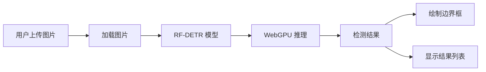

# RF-DETR 实时目标检测

<div align="center">


基于 RF-DETR 模型的浏览器端实时目标检测应用，使用 Transformers.js 实现完全在客户端运行的 AI 目标检测。

[在线演示](#) | [模型详情](https://huggingface.co/onnx-community/rfdetr_medium-ONNX) | [报告问题](../../issues)

</div>

---


## ✨ 特性

- 🚀 **完全客户端运行** - 无需服务器，保护用户隐私
- ⚡ **WebGPU 加速** - 利用浏览器内置 GPU 实现实时推理
- 🎯 **高精度检测** - 支持 COCO 80 类目标检测
- 🌐 **跨平台支持** - 支持所有现代浏览器
- 📦 **零配置部署** - 开箱即用，无需复杂配置
- 🎨 **美观界面** - 现代化的用户界面设计

---

## 📋 目录

- [模型介绍](#-模型介绍)
- [快速开始](#-快速开始)
- [安装步骤](#-安装步骤)
- [使用方法](#-使用方法)
- [支持的检测类别](#-支持的检测类别)
- [技术架构](#-技术架构)
- [浏览器兼容性](#-浏览器兼容性)
- [部署到 GitHub Pages](#-部署到-github-pages)
- [常见问题](#-常见问题)
- [许可证](#-许可证)

---

## 🤖 模型介绍

### 模型基本信息

| 属性 | 值 |
|------|-----|
| 模型名称 | onnx-community/rfdetr_medium-ONNX |
| 模型类型 | Object Detection (目标检测) |
| 框架 | ONNX (Transformers.js 兼容) |
| 模型大小 | 358 MB |
| 许可证 | Apache-2.0 |
| 下载量 | 44+ (上月) |

### 模型架构

RF-DETR (Real-Fast DEtection TRansformer) 是基于 DETR (DEtection TRansformer) 架构的目标检测模型，专门优化用于实时推理。

**技术特点:**
- ✅ 基于 Transformer 的端到端目标检测
- ✅ 无需 NMS (非极大值抑制) 后处理
- ✅ 支持实时推理的优化变体
- ✅ ONNX 格式优化，可直接在浏览器运行

### 性能特点

- **推理设备**: WebGPU (浏览器内置GPU加速)
- **精度**: fp32 (32位浮点)
- **预处理**: 自动图像缩放和归一化
- **输出格式**: 边界框坐标 + 类别标签 + 置信度分数

---

## 🚀 快速开始

### 前置要求

- Node.js 16+ 或 Bun
- 支持 WebGPU 的现代浏览器（Chrome 113+, Edge 113+）

### 一键启动

```bash
# 克隆仓库
git clone https://github.com/你的用户名/rf-detr-detection.git
cd rf-detr-detection

# 安装依赖
npm install

# 启动开发服务器
npm run dev
```

打开浏览器访问 `http://localhost:5173`

---

## 📦 安装步骤

### 方法 1: 使用 npm

```bash
# 1. 克隆项目
git clone https://github.com/你的用户名/rf-detr-detection.git
cd rf-detr-detection

# 2. 安装依赖
npm install

# 3. 启动开发服务器
npm run dev

# 4. 构建生产版本
npm run build

# 5. 预览生产版本
npm run preview
```

### 方法 2: 使用 Bun (更快)

```bash
# 1. 克隆项目
git clone https://github.com/你的用户名/rf-detr-detection.git
cd rf-detr-detection

# 2. 安装依赖
bun install

# 3. 启动开发服务器
bun run dev
```

### 方法 3: 直接使用 (无需构建)

如果你只想快速测试，可以使用 CDN 版本：

```html
<!DOCTYPE html>
<html>
<head>
    <script type="module">
        import { pipeline } from 'https://cdn.jsdelivr.net/npm/@huggingface/transformers@3.1.2';
        // 你的代码...
    </script>
</head>
<body>
    <!-- 你的 HTML -->
</body>
</html>
```

---

## 📖 使用方法

### 基本使用

1. **启动应用**
   ```bash
   npm run dev
   ```

2. **上传图片**
   - 点击上传区域选择图片
   - 或直接拖拽图片到上传区域

3. **查看结果**
   - 等待模型加载（首次使用需要下载模型，约 358MB）
   - 自动检测图片中的目标
   - 查看标注的边界框和检测结果列表

### 代码示例

```javascript
import { pipeline } from '@huggingface/transformers';

// 创建目标检测管道
const detector = await pipeline(
    'object-detection',
    'onnx-community/rfdetr_medium-ONNX',
    {
        device: 'webgpu',  // 使用 WebGPU 加速
        dtype: 'fp32',     // 浮点32位精度
    }
);

// 检测图像
const results = await detector(image, {
    threshold: 0.3,   // 置信度阈值
    percentage: true  // 返回百分比坐标
});

console.log(results);
// 输出: [{ box: {...}, label: 'person', score: 0.98 }, ...]
```

### 调整检测参数

在 `main.js` 中修改检测参数：

```javascript
const results = await detector(img, {
    threshold: 0.5,   // 提高阈值以减少误检（默认 0.3）
    percentage: true  // 使用百分比坐标
});
```

---

## 🎯 支持的检测类别

本模型支持 COCO 数据集的 80 个类别：

### 人物
`person` (人物)

### 车辆 (8类)
`bicycle` (自行车), `car` (汽车), `motorcycle` (摩托车), `airplane` (飞机), `bus` (公交车), `train` (火车), `truck` (卡车), `boat` (船)

### 交通设施 (4类)
`traffic light` (交通灯), `fire hydrant` (消防栓), `stop sign` (停止标志), `parking meter` (停车计时器)

### 动物 (10类)
`bird` (鸟), `cat` (猫), `dog` (狗), `horse` (马), `sheep` (羊), `cow` (牛), `elephant` (大象), `bear` (熊), `zebra` (斑马), `giraffe` (长颈鹿)

### 物品 (15类)
`backpack` (背包), `umbrella` (雨伞), `handbag` (手提包), `tie` (领带), `suitcase` (行李箱), `frisbee` (飞盘), `skis` (滑雪板), `snowboard` (滑雪板), `sports ball` (运动球), `kite` (风筝), `baseball bat` (棒球棒), `baseball glove` (棒球手套), `skateboard` (滑板), `surfboard` (冲浪板), `tennis racket` (网球拍)

### 餐饮 (16类)
`bottle` (瓶子), `wine glass` (酒杯), `cup` (杯子), `fork` (叉子), `knife` (刀), `spoon` (勺子), `bowl` (碗), `banana` (香蕉), `apple` (苹果), `sandwich` (三明治), `orange` (橙子), `broccoli` (西兰花), `carrot` (胡萝卜), `hot dog` (热狗), `pizza` (披萨), `donut` (甜甜圈), `cake` (蛋糕)

### 家具 (6类)
`chair` (椅子), `couch` (沙发), `potted plant` (盆栽), `bed` (床), `dining table` (餐桌), `toilet` (马桶)

### 电子设备 (11类)
`tv` (电视), `laptop` (笔记本电脑), `mouse` (鼠标), `remote` (遥控器), `keyboard` (键盘), `cell phone` (手机), `microwave` (微波炉), `oven` (烤箱), `toaster` (烤面包机), `sink` (水槽), `refrigerator` (冰箱)

### 其他 (9类)
`book` (书), `clock` (时钟), `vase` (花瓶), `scissors` (剪刀), `teddy bear` (泰迪熊), `hair drier` (吹风机), `toothbrush` (牙刷)

---

## 🏗️ 技术架构

### 项目结构

```
rf-detr-detection/
├── index.html          # 主页面
├── main.js             # 主程序逻辑
├── package.json        # 项目配置
├── README.md           # 项目文档
├── DEPLOY.md           # 部署指南
└── .gitignore          # Git 忽略文件
```

### 技术栈

- **前端框架**: Vanilla JavaScript (无框架依赖)
- **AI 库**: Transformers.js 3.1.2
- **构建工具**: Vite 5.0
- **加速技术**: WebGPU
- **模型格式**: ONNX

### 工作流程



---

## 🌐 浏览器兼容性

### 支持的浏览器

| 浏览器 | 最低版本 | WebGPU 支持 |
|--------|---------|------------|
| Chrome | 113+ | ✅ |
| Edge | 113+ | ✅ |
| Opera | 99+ | ✅ |
| Safari | 技术预览版 | 🚧 实验性 |
| Firefox | - | ❌ 开发中 |

### 检查 WebGPU 支持

在浏览器控制台运行：

```javascript
if ('gpu' in navigator) {
    console.log('✅ WebGPU 已支持');
} else {
    console.log('❌ WebGPU 不支持');
}
```

### 降级方案

如果浏览器不支持 WebGPU，可以修改 `main.js` 使用 WASM 后端：

```javascript
const detector = await pipeline('object-detection', 'onnx-community/rfdetr_medium-ONNX', {
    device: 'wasm',  // 使用 WASM 代替 WebGPU
    dtype: 'fp32',
});
```

---

## 🚀 部署到 GitHub Pages

详细部署步骤请查看 [DEPLOY.md](DEPLOY.md)

### 快速部署

```bash
# 1. 构建项目
npm run build

# 2. 部署到 GitHub Pages
# 方法 A: 使用 gh-pages 包
npm install -D gh-pages
npx gh-pages -d dist

# 方法 B: 手动推送到 gh-pages 分支
git subtree push --prefix dist origin gh-pages
```

---

## ❓ 常见问题

### Q: 模型加载很慢怎么办？

A: 首次加载需要下载 358MB 的模型文件，建议使用稳定的网络连接。模型会被浏览器缓存，后续使用会更快。

### Q: 检测结果不准确？

A: 可以尝试：
1. 调整 `threshold` 参数（默认 0.3）
2. 使用更清晰的图片
3. 确保图片中的目标属于 COCO 80 类

### Q: 浏览器不支持 WebGPU？

A: 可以切换到 WASM 后端（见浏览器兼容性章节），或升级到支持 WebGPU 的浏览器版本。

### Q: 可以检测视频吗？

A: 当前版本仅支持图片检测。如需视频检测，可以参考 [HuggingFace Space](https://huggingface.co/spaces/webml-community/RF-DETR-Medium-WebGPU) 的实现。

---

## 📚 相关资源

- [HuggingFace 模型页面](https://huggingface.co/onnx-community/rfdetr_medium-ONNX)
- [Transformers.js 文档](https://huggingface.co/docs/transformers.js)
- [WebGPU 规范](https://www.w3.org/TR/webgpu/)
- [COCO 数据集](https://cocodataset.org/)

---

## 🤝 贡献

欢迎提交 Issue 和 Pull Request！

1. Fork 本仓库
2. 创建特性分支 (`git checkout -b feature/AmazingFeature`)
3. 提交更改 (`git commit -m 'Add some AmazingFeature'`)
4. 推送到分支 (`git push origin feature/AmazingFeature`)
5. 开启 Pull Request

---

## 📄 许可证

本项目采用 Apache-2.0 许可证 - 详见 [LICENSE](LICENSE) 文件

---

## 🙏 致谢

- [Hugging Face](https://huggingface.co/) - 提供模型和 Transformers.js 库
- [ONNX Community](https://huggingface.co/onnx-community) - 提供 ONNX 格式模型
- [RF-DETR 团队](https://github.com/lyuwenyu/RT-DETR) - 原始模型开发

---

<div align="center">

**⭐ 如果这个项目对你有帮助，请给个 Star！**

Made with ❤️ by [Your Name]

</div>
